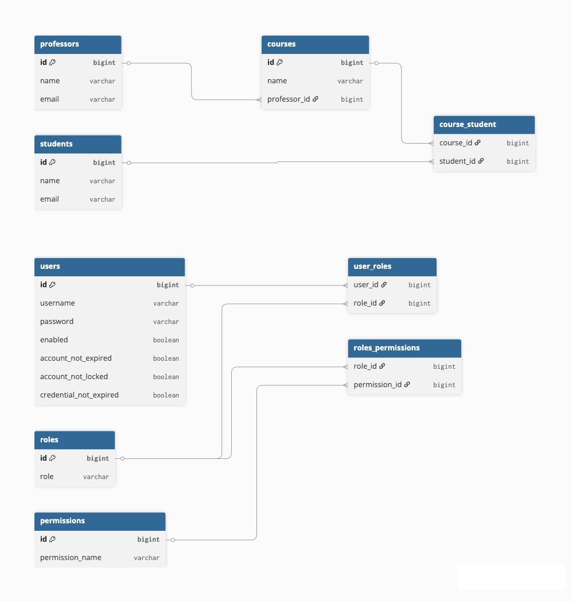

# Virtual Classroom System

API REST para una plataforma educativa desarrollada con Spring Boot y Spring Security que permite gestionar estudiantes, profesores y cursos dentro de un aula virtual. Los administradores, profesores y estudiantes interactúan con los recursos disponibles según sus roles y permisos, garantizando el acceso únicamente a usuarios autorizados.

El sistema implementa un modelo de autorización basado en roles (RBAC), donde:
- Los administradores gestionan usuarios, roles y permisos, y asignan profesores y estudiantes a cursos
- Los profesores están asignados a cursos y pueden acceder a la lista de estudiantes de los mismos
- Los estudiantes pueden acceder a los cursos a los que fueron asignados

## Tecnologías utilizadas

* Java 17
* Spring Boot
* Spring Security
* JWT (JSON Web Tokens)
* Autenticación mediante OAuth2
* JPA / Hibernate
* MySQL
* Maven

## Arquitectura
El sistema sigue una arquitectura en capas.

### security.config
Contiene la configuración relacionada con Spring Security, incluyendo:
* Configuración de reglas de autorización
* Integración de autenticación mediante JWT
* Soporte para autenticación mediante OAuth2
* Filtros de seguridad para validar tokens en cada request

### utils
Incluye clases auxiliares como JwtUtils
* Generación y validación de tokens JWT
* Extracción de información del token

### controller
Contiene los endpoints de la API REST que exponen la funcionalidad del sistema. Estos se encuentran securizados mediante anotaciones para que los usuarios accedan a los recursos en función de sus roles.
Entre ellos se incluyen:

AuthenticationController
- Maneja la autenticación de usuarios
- Genera tokens JWT para usuarios válidos

### service
Cada entidad principal cuenta con su propio servicio que se encarga de validar datos, aplicar reglas de negocio, coordinar la interacción con los repositorios y gestionar las relaciones entre entidades.
Además incluye:

UserDetailsServiceImp
- Integración con Spring Security para cargar usuarios desde la base de datos durante el proceso de autenticación.

### repository
Cada entidad del dominio posee su correspondiente repositorio.

### model
Estas entidades modelan las relaciones del sistema, permitiendo:
* Asociar usuarios con roles
* Asignar permisos a roles
* Relacionar profesores y estudiantes con cursos

### dto
Contienen los Data Transfer Objects utilizados para recibir datos desde el cliente, enviar respuestas estructuradas y evitar exponer directamente las entidades del modelo.

## Aspectos Destacados del Proyecto
* Autenticación y autorización de usuarios en la API mediante Spring Security
* Generación y validación de tokens JWT para acceso seguro
* Integración de autenticación mediante OAuth2
* Sistema de control de acceso basado en roles (RBAC) para gestionar permisos
* Encriptado de contraseñas antes de su almacenamiento mediante PasswordEncoder
* Protección de endpoints mediante reglas de autorización
* Uso de seguridad a nivel de método para validar permisos en métodos específicos
* Uso de programación funcional (Streams, Optional y expresiones lambda)
* Aplicación de buenas prácticas de organización y separación de responsabilidades

## Diagrama del modelo
El siguiente diagrama representa las principales entidades del sistema y sus relaciones:

## Estado del proyecto
Proyecto actualmente en desarrollo.  
Se continúan incorporando mejoras en seguridad, organización del código y funcionalidades adicionales.
